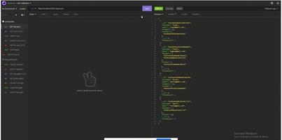
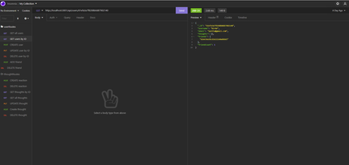
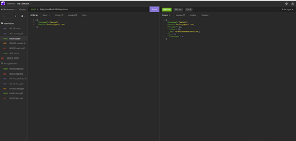
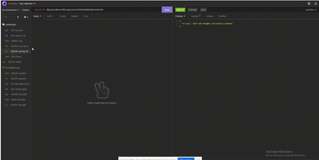
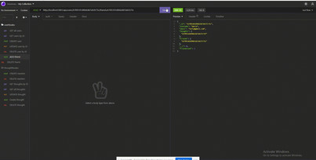
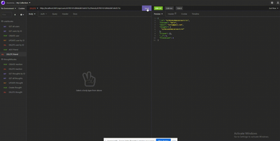
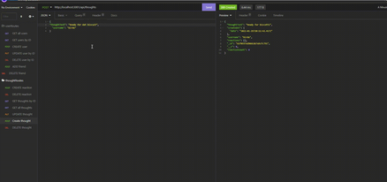
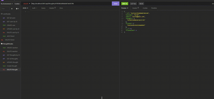
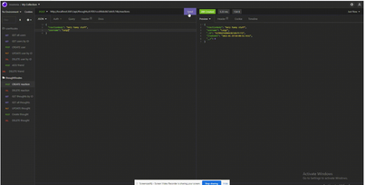
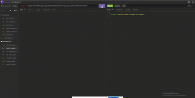

# Social Mongoose API

# Description
This assignment represents a Social Network web application that enables users to share thoughts, add or remove friends from your friends list and even react to any users thoughts.

[

Creating and Deleting Thoughts

[

# Table of Contents
* [Installation](#installation)
* [Usage](#usage)
* [Contributions](#contributions)
* [Questions](#questions)

## Installation
### You will need to install the following dependencies prior to running the application: 

Mongoose and Express

## Usage 
### Below are the following steps required to run this application: 

1. With insomnia deployed is deployed and you have populated the /users endpoint, you will be presented with all the users.

2. You can also filter users by changing their endpoints in accordance to a specific users id.

3. You can create and delete users by populating json with correct parameters.

4. You are also able to add and delete friends by including their ids at their endpoints.

5. Users can have thoughts and thoughts can also have their own reactions field in which they can add or delete their reactions. .

## Contributions 

No contributions have been made.

## Questions
### If you have a questions or concerns, feel free to contact me at Lsanti618@gmail.com.
